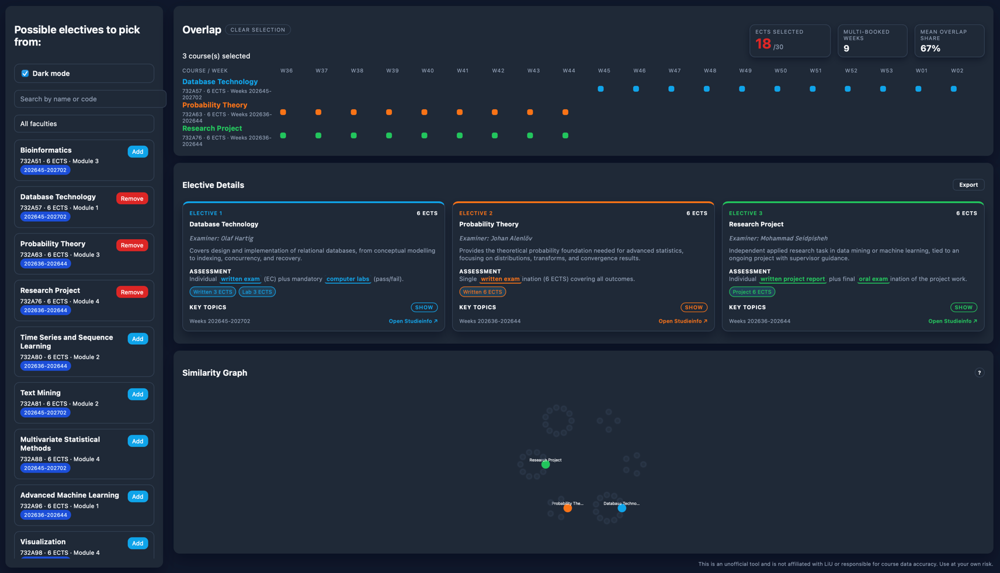

# Course Visualizer

Interactive React + Vite tool for comparing LiU third‑semester electives. It renders the programme’s elective list, lets you build a tentative schedule, and highlights week overlaps, cumulative ECTS, and topical similarity between courses.

<div align="center">
  
</div>


## Quick Start
1. **Enter the project directory**
   ```bash
   cd course-visualizer
   ```
   The remaining commands assume this as your working directory (Node 18+ recommended).
2. **Install dependencies**
   ```bash
   npm install
   ```
3. **Run locally**
   ```bash
   npm run dev
   ```
   Vite prints a local URL (default `http://localhost:5173`). The built assets live in `dist/` after `npm run build`, and `npm run preview` serves the production bundle.
4. **Static preview** (no dev server): `npm run serve-static` publishes the already-built `dist/` folder via [`serve`](https://www.npmjs.com/package/serve).

## What the app is for
- Easily compare electives: search by name/code, filter by faculty, and inspect modules/weeks.
- Visualize week overlaps: Shows double-booked weeks per course, plus high-level metrics (ECTS selected, mean overlap share, etc.).
- Inspect assessment details: each card surfaces summary text, highlighted assessment keywords, and the written/lab/project/oral ECTS breakdown.
- Explore topical proximity: the similarity graph clusters courses either by shared keywords or by OpenAI embeddings (if available).
- Export/share: download a CSV with the currently selected electives and their Studieinfo links to continue planning elsewhere.

## Data sources & collection
### `course-visualizer/courses.json`
- Content: Snapshot of the HT2026/VT2027 Studieinfo pages for the third-semester Computer Science programme (English versions). Each record retains the official course link plus derived helpers such as `weekList` and `weekLookup` (computed at runtime).
- Fields: `Course_Name`, `Course_Code`, individual ECTS buckets, `Exam_Format`, free-text `Summary`/`Key_Topics`, `Timetable_Module`, ISO-like `Weeks` range (`YYYYWW-YYYYWW`), and internal notes.
- Collection method (March 2026): manually copy the relevant details from [Studieinfo](https://studieinfo.liu.se) for each elective, double-check the week/module info against the published timetable PDF, and ensure the URL points to the English course description. No scraping or unpublished data was used.
- Updating: edit `courses.json`, keeping numeric fields as strings to avoid locale issues. After edits, re-run the app and the derived week/topic tokens will be recomputed automatically.

### Embeddings (`course-visualizer/data/openai_embeddings.jsonl`)
- Purpose: feed the similarity graph with cosine-similarity edges between electives.
- Generation: run `OPENAI_API_KEY=sk-... npm run fetch-embeddings`, which executes `scripts/fetch_embeddings.js`. The script sends the course name/code plus `Key_Topics` text to OpenAI’s `text-embedding-3-large` model and writes JSON Lines with `{ courseCode, courseName, source, dimensions, embedding }`.
- Storage: each line is roughly 25–30 KB (3072 floats).
- Privacy: only publicly available course descriptions are sent to OpenAI; no student data is involved.

## Disclaimer
- **Unofficial tool**: This project is not affiliated with Linköping University. Data was copied from public Studieinfo pages and may lag behind official updates.
- **No guarantees**: Course availability, timetable modules, ECTS splits, and exam formats change frequently. Always confirm details with Studieinfo, the programme office, or your examiner before registering.
- **Use at your own risk**: The visualization should assist personal planning only. Do not rely on it for binding study decisions.
